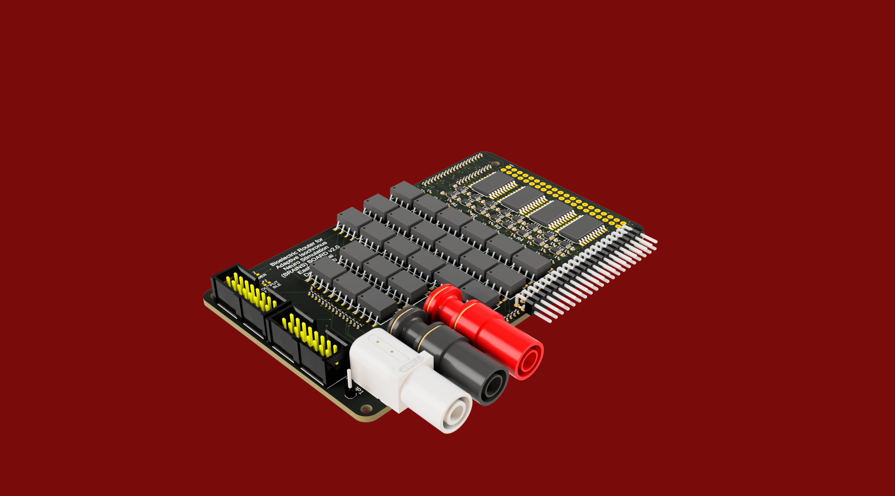
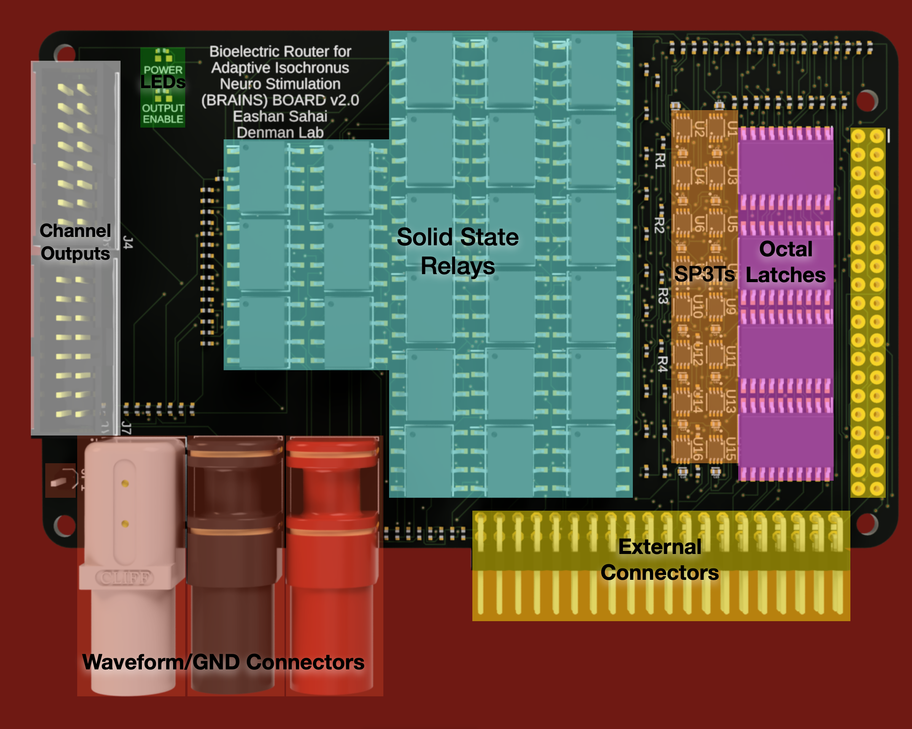
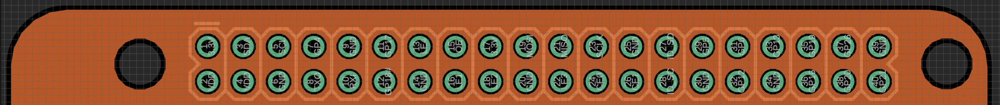
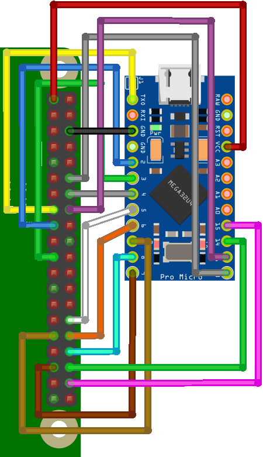
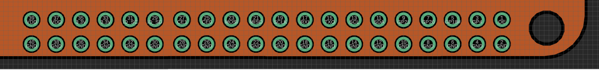
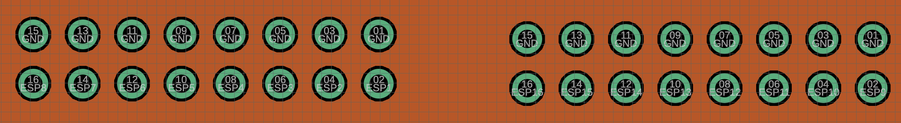
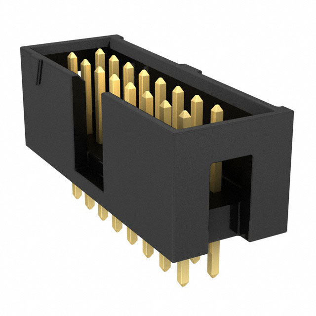

# BRAINSBoard

# Introduction

# STG5 and BRAINSBoard GUI
### This will be a quick guide on how to use all the different tools developed for the BRAINSBoard, STG5 and more!

These are both useful tools used in conjunction with one another to easily allow for multi-channel stimulation of the NeuroNexus A1x16 16-Channel Electrode.
# SECTION 1: HARDWARE
## BRAINSBoard:
### Purpose

The BRAINSBoard is a proprietary custom PCB that is designed to electronically switch between Cathode, Anode, Ground, and Floating states for 16 different electrode channels without physically interacting with the components during experiments. This enables:
- Stimulation at different loci in patterns.
- Grounding of every inactive pin to prevent noise.
- Use with a GUI designed for efficient pin switching during and between experiments.

### Components of the Board

#### Connectors
- $\textbf{\color{yellow}Raspberry Pi/Arduino 2x20 Female Header}$ facilitates connections to control and process data from Arduino/Raspberry Pi. $\textbf{\color{yellow}2x20 90º Male Header}$ allows external connections to unused/useful pins
  - Raspberry Pi can be directly connected on top of the $\textbf{\color{yellow}2x20 Female Header}$. Connection Pinout as follows:

  - An Arduino can be connected to those same pins with the following Pinout (demonstrated with Arduino Pro Mini):
 

  - Other tools (ie. sensors, actuators, external triggers) can be accessed from the $\textbf{\color{yellow}2x20 90º Male Header}$ with the following Pinout:

- $\textbf{\color{white}NeuroNexus}$ Standard 2x8 Box Connectors with grounding on all top pins to minimize noise. Pinout:

- $\textbf{\color{red}Banana Connectors:}$ Connects to cathode and anode pulses from an Isolated Analog Power Stimulator (preferred STG5) and a Signal Ground that can be connected to the same common ground as the electrode and stimulator.

#### Products Used:

$\textbf{\color{yellow}External Connectors:}$

[2x20 Female Header](https://www.digikey.com/en/products/detail/te-connectivity-amp-connectors/2-215307-0/1149668)

[2x20 90º Male Header](https://www.digikey.com/en/products/detail/oupiin/2011-2X20G00RB/13251482)

$\textbf{\color{white}Connectors to Neuronexus:}$

**Samtec Box Header** from [Digikey](https://www.digikey.com/en/products/detail/samtec-inc/TSS-108-01-G-D/2345166):

$\textbf{\color{red}Connectors to Analog Stimulus Isolator:}$

[Ground Connector](https://www.digikey.com/en/products/detail/cliff-electronic-components-ltd/FCR7350G/17729033)

[Cathode Stimulus Connector](https://www.digikey.com/en/products/detail/pomona-electronics/73099-2/10483465)

[Anode Stimulus Connector](https://www.digikey.com/en/products/detail/pomona-electronics/73099-0/10483460)

### Electronics for Selecting Channels:

The following are used to be able to utilize Arduino Logic and rapidly change the connection between our stimulus signal from the isolated stimulator and the respective electrode channels.

#### $\textbf{\color{#FF69B4}Octal Transparent D-Type Latch}$
- Requires a VCC +5V and ground.
- Output Enable and Latch Enable controls, connected to Arduino/Raspberry Pi, to manage pin outputs.
- Utilizes multiplexing capabilities to reduce connections needed to the microcontronoller and allows for future scalability.
- Latch capabilities ensure channel selection stability until change is required.
- [Texas Instruments Octal Transparent D-Type Latch](https://www.digikey.com/en/products/detail/texas-instruments/CY74FCT373TSOC/1508737)

#### $\textbf{\color{orange}Analog SP3T Switch}$
- Two inputs determine the current path (cathode, anode, ground, or floating).
- Output directed through a connector managing pin outputs.
- Useful digital switch to ensure one of the four output states is set at all times.
- [Texas Instruments Analog SP3T Switch](https://www.digikey.com/en/products/detail/texas-instruments/TS5A3357DCUR/695801)

#### $\textbf{\color{cyan}Solid State Relay}$
- Activated by a control switch, it powers an LED internally, which in turn activates a photosensitive diode to close the circuit.
- Optical Isolation prevents electrical interference from the microcontroller side of the circuit to the Analog Isolator stimulus sent to the respective channels.
- These specific Solid State Relays will be useful in handling high variance in Volatge due to unpredictable resistance in the brain as current stimulus is sent.
- [IXYS 600V 100mA Dual Single Pole Normally Open Relay](https://www.digikey.com/en/products/detail/ixys-integrated-circuits-division/PAA193STR/3077694)

#### $\textbf{\color{green}LEDS}$
- Top LED is a $\text{\color{red}RED LED}$ that is utilized to indicate whether or not the BRAINS Board is receiving power.
- Bottom LED is a $\text{\color{green}GREEN LED}$ that is utilized to indicate whether the Output Enable is activated, determining whether or not outputs are being sent to change channels

# SECTION 2: BRAINS BOARD SPECIFIC SOFTWARE

There are various sets of code designed to interface with the BRAINS Board through either the Arduino or Raspberry Pi.
These are guides on how they are designed as well as a simple measure as to how they may be manipulated for various uses.

## PART 1: Using Serial Communication with Arduino to Map Channels:

The current BRAINS Board API is built around Serial Inputs that are translated into pin activation using the [Brainsboard Serial Program Arduino Code](brainsboard_serial_pgm.ino)

This is also all right now designed to be used alongside an Arduino Micro Pro with the pinout shown above in [this image](images/BB2ProMicro_bb.png), though it can easily be changed to work with any Arduino board and pinout using the #define functions.

The following pins correspond to channels above:
| Electrode Channel |    Arduino Pins     |
|:-----------------:|:-------------------:|
| Channel **1**     | Pin 16 + 1 + 5 + 6  |
| Channel **2**     | Pin 16 + 1 + 7 + 8  |
| Channel **3**     | Pin 16 + 1 + 9 + 10 |
| Channel **4**     | Pin 16 + 1 + 14 + 15|
| Channel **5**     | Pin 16 + 2 + 5 + 6  |
| Channel **6**     | Pin 16 + 2 + 7 + 8  |
| Channel **7**     | Pin 16 + 2 + 9 + 10 |
| Channel **8**     | Pin 16 + 2 + 14 + 15|
| Channel **9**     | Pin 16 + 3 + 5 + 6  |
| Channel **10**    | Pin 16 + 3 + 7 + 8  |
| Channel **11**    | Pin 16 + 3 + 9 + 10 |
| Channel **12**    | Pin 16 + 3 + 14 + 15|
| Channel **13**    | Pin 16 + 4 + 5 + 6  |
| Channel **14**    | Pin 16 + 4 + 7 + 8  |
| Channel **15**    | Pin 16 + 4 + 9 + 10 |
| Channel **16**    | Pin 16 + 4 + 14 + 15|

**The logic is this way because of the following:**

- Our **Output Enable** pin, that is connected to all 4 of the Octal Latches, is connected to **Arduino Pin 16**
- We have 4 **Latch Enable** pins that are used to determine which latch we are controlling
  - **Pin 1** is connected to the first **OCTAL LATCH**, which controls signals sent to the **SP3T** switches that set channel configuration for **Electrode Channels 1-4**
  - **Pin 2** is connected to the second **OCTAL LATCH**, which controls signals sent to the **SP3T** switches that set channel configuration for **Electrode Channels 5-8**
  - **Pin 3** is connected to the third **OCTAL LATCH**, which controls signals sent to the **SP3T** switches that set channel configuration for **Electrode Channels 9-12**
  - **Pin 4** is connected to the fourth **OCTAL LATCH**, which controls signals sent to the **SP3T** switches that set channel configuration for **Electrode Channels 13-16**
- We then have **8 Data Input** pins connected to all of the **Octal Latches**, which will change the state of the digital output of the latches to High or Low dependent on a) if the latch enable for said Octal Latch is on and b) if the Arduino pin connected to each digital input pin is high or low
  - **Pins 5 and 6** control the output to the **SP3T** controlling **Electrode Channels 1, 5, 9, and 13**.
  - **Pins 7 and 8** control the output to the **SP3T** controlling **Electrode Channels 2, 6, 10, and 14**.
  - **Pins 9 and 10** control the output to the **SP3T** controlling **Electrode Channels 3, 7, 11, and 15**.
  - **Pins 14 and 15** control the output to the **SP3T** controlling **Electrode Channels 4, 8, 12, and 16**.

**Important Note:** The **A0 pin** is used as an input of any External Triggers from any other device (ie. a stimulator) for the board to use as an input to switch channels, if required.

The code also has 4 states that any channel can be set to at any given moment: **FLOATING**, **CATHODE**, **ANODE**, and **SIGNAL GROUND**. The board is designed to allow the **OCTAL LATCH** to send 2 outputs to any given **SP3T** correlated to a specific electrode channel, and logic of the switch by the **SP3T** is treated as follows:
| INPUT 1 STATE | INPUT 2 STATE | CHANNEL CONNECTED |
|:-------------:|:-------------:|:-----------------:|
| **LOW**       | **LOW**       | **FLOATING**      |
| **HIGH**      | **LOW**       | **CATHODE**       |
| **LOW**       | **HIGH**      | **ANODE**         |
| **HIGH**      | **HIGH**      | **SIGNAL GROUND** |

**Important Note:** The **SIGNAL GROUND** is connecting any signal connected to the $\textbf{\color{green}Green Banana Connector}$, which should ideally connected to the same **Reference Ground** that you would use for any electrophysiology or stimulation experiment.

### Serial Communication Logic:
**The following is a step-by-step guide for utilizing any serial communication to control the channel outputs at any given time**
1. Ensure you are using 115200 bps as the data rate for for Serial line
2. '[' Begins reading channel Data
3. **'{X1}'** is a *Hexadecimal Number*
    - **To Set Channels 1-10:** X1 corresponds to a numerical value Channel # - 1 (ie. Channel 1 is 0, Channel 2 is 1, ..., Channel 10 is 9)
    - **To Set Channels 11-16:** X1 corresponds to an alphabtical value between A-F (ie. Channel 11 is A, Channel 12 is B, ..., Channel 16 is F)
4. **'{X2}'** is a *Character*
      - **F** for **FLOATING**
      - **C** for **CATHODE**
      - **A** for **ANODE**
      - **G** for **SIGNAL GROUND**
5. **']'** Closes *Reading Channel States* and *"Applies"* the channel states by utilizing logic to change where channels are connected
6. **'x'** Sets a *wait* until the **External Trigger Pin** recieves a signal (and won't continue until that trigger is low to change anything)
7. **'{t}{u}'** Sets a *wait* for a set time
      - **'{t}'** is a *numerical value* that is read and stored until the serial code reads a non-numerical value
      - **'{u}'** is a *character* that is written after the numerical values have been written that determines the units of delay time
        - **s** will set the *time {t}* to seconds
        - **m** will set the *time {t}* to milliseconds
        - **u** will set the *time {t}* to microseconds
8. **'l{c}'** Sets up a *loop* for the inputted channel setups for *{c}* more counts
      - If *{c}* is not set, it will infinitely loop.
9. **Important Note:** It is not necessary to write out every channel, previous channel states are already stored and latched until that specific channel is changed
#### Example Serial Command:
**[0F1F2F3F4F5F6F7F8F9FAFBFCFDFEFFF]200u[0C1A]x[0G1GEAFC]2sl3**
- This will first **set every channel** to **FLOATING**
- It will then **wait 200 microseconds**
- It will then change **Channel 1** to **CATHODE** and **Channel 2** to **ANODE**
- It will then **wait** until it recieves the **External Trigger** at **Pin A0**
- It will then change **Channel 1** and **Channel 2** to **SIGNAL GROUND** and **Channel 15** to **ANODE** and **Channel 16** to **CATHODE**
- It will then **wait 2 seconds**
- It then reads **l3**, so it will **loop** the previous steps **3 more times**

## PART 2: Using the Raspberry Pi to Map Channels Directly

The BRAINS Board was initially designed to directly integrate the various connections on a Raspberry Pi to map pins to channels and work harmoniously as a modular device that can work alongside other tools in an experimental setting. There are both benefits and drawbacks to using this microcontroller over an Arduino, laid out as follows:
### BENEFITS:
1. BRAINS Board easily snaps into a Raspberry Pi, no external connection is needed
2. Any pins not used to directly control the logic of the BRAINS Board can be easily accessed through the side male pins, following the pinout shown above in [this image](images/BB_2_external_pins_Pinout.png)
3. Doesn't rely on Serial Communication to switch pinout, which can reduce latency
4. Allows for communication over WiFi which allows for non-wired control to directly switch channels
**When Using This Microcontroller Is Better:** The ideal use for the Raspberry Pi over an Arduino is when you are just reading an external signal or series of them and want to create a closed loop transition between channels based on multiple complicated inputs feeding directly into the Raspberry Pi, given that those inputs are able to be read by the Linux system and processed that way, **OR** when latency isn't very important but non-wired communication is essential or easier. 
### DRAWBACKS:
1. Raspberry Pi uses CPU for running Debian, can create unwanted latency due to other processes running
2. Latency of WiFi communication relatively high
3. Serial read latency of Raspberry Pi is higher than Arduino Serial read latency
4. Debian (Linux) software won't run various softwares (many stimulator softwares are written specifically for Windows computer)
**When Using This Microcontroller is Not Optimal:** The Arduino controller is better when running integrated software with other devices that need a computer to process the information or program other things at the same time (ie. the STG5 Isolated Analog Stimulator, a MultiChannelSystems product that can only be customizably programmed on a Windows using their .dll Package for Windows) **OR** if latency based on external readings is critical and the processing can't be done on a Raspberry Pi (ie. if there were a developed closed-loop system based on the readings of inserted Neuropixels real-time to manipulate activated channels in a closed-loop system).

With that said, there are only a few changes in terms of the pinout when programming as such, all already established with the [GPIO](GPIO.py) script already set. The connections to the BRAINS Board from GPIO pins on the Raspberry Pi are as follows:

| PIN ON BRAINS BOARD | GPIO PIN ON RASPBERRY PI |
|:-------------------:|:------------------------:|
|**OE PIN**           | 22                       |
|**LE PIN 1**         | 23                       |
|**LE PIN 2**         | 24                       |
|**LE PIN 3**         | 25                       |
|**LE PIN 4**         | 27                       |
|**DIGITAL INPUT 1**  | 5                        |
|**DIGITAL INPUT 2**  | 6                        |
|**DIGITAL INPUT 3**  | 12                       |
|**DIGITAL INPUT 4**  | 13                       |
|**DIGITAL INPUT 5**  | 16                       |
|**DIGITAL INPUT 6**  | 17                       |
|**DIGITAL INPUT 7**  | 19                       |
|**DIGITAL INPUT 8**  | 26                       |

The GPIO code uses these and just takes 16 individual strings as channel_state = [...] with **F** for **FLOATING**, **C** for **CATHODE**, **A** for **ANODE**, and **G** for **SIGNAL GROUND** and the delay can be set using the precise_sleep function. Use general Python functionality to be able to program this any which way.

# SECTION 3: STG5

The stimulator of choice for this project is the [Multi Channel Systems STG5](https://www.multichannelsystems.com/products/stg5-base). This product has all the stimulating capabilities that we require for our electrophysiology experiments, can both recieve external triggers and produce a digital output that can be aligned with an analog stimulus sent, and is most importantly programmable beyond the base software that comes with the STG5. We designed our own custom GUI to perform stimulation experiments for monopolar, bipolar, and multipolar stimulation that can be paired with the BRAINS Board. Lets break down the various features of our GUI:

## FEATURE 1: LOCALHOST WEB GUI:

The GUI is all written in Python, but utilizes the [Holoviz Panel Library](https://panel.holoviz.org/index.html) to setup a locally hosted Web GUI that can run on any device
**IMPORTANT NOTE:** THE GUI MUST BE RUN ON A WINDOWS DEVICE IN ORDER TO CONNECT WITH THE STG5 GUI
**IMPORTANT NOTE 2:** THE MCSUsbNet .dll package must be setup from [here](https://github.com/multichannelsystems/McsUsbNet/tree/086642d15fa1b8b805cdc137db4652151c30f9f5) in order to work. Ensure that the packages and files in the MCSUsbNet folder in this repository have all the required permissions to run, otherwise there will be errors.

**Once everything is setup, run the [STG5 and BRAINS Board Joint GUI](STG5_BRAINSBoard_Joint_GUI.py) Python Script to start up the GUI so that you can manipulate the next features

## FEATURE 2: EVENT SETTINGS:

When you first run the GUI, the *EVENT SETTINGS* tab will be the primary tab opened. You will notice the following:
- First you will have the *Waveform Type Selector* that has three options: **Monophasic**, **Biphasic**, and **Sinusoidal**
- You will have the *Modulation Type Selector* directly underneath it, giving the options of sending a set **Voltage** or **Current** from the STG5
- You then have the *Amplitude Selection* underneath those two Radio Buttons
  - On the left is the *Amplitude Slider* where you can easily set the numeric value for your Amplitude
  - Next to the slider, you get the *Unit Selector*, which gives you the option of setting the units of your waveform. If **Voltage** is selected from your *Modulation Type Selector*, your options are **uV**, **mV** or **V** and if **Current** is selected from your *Modulation Type Selector*, your options are **uA**, **mA**, or **A**.
  - You also have the *Randomize* slider and button, which allows you to choose a range and randomize the amplitude of your waveform when the random button is clicked.
- If **Monophasic** or **Biphasic** is selected:
  - There is a *Pulse Duration Slider* and *Unit Selector Button* for setting the Pulse Duration in microseconds, milliseconds, or seconds
  - If **Biphasic** specifically is selected, there will be text stating whether the waveform is **Cathode Leading**, **Anode Leading**, or **Neither** and it is **IMPORTANT TO NOTE: THE PULSE DURATION IS SET FOR ONE HALF OF THE WAVEFORM, NOT TOTAL PUSLE DURATION**
  - You also get a *Randomizer* pulse duration if needed.
- If **Sinusoidal** is selected:
   - You get a *Wavelength Type Selector* that gives you the option to choose between setting the Period or Frequency of the Waveform, with a *Wavelength Slider* with the same functionality as other sliders with a *Unit Selector* and *Randomizer*
   - There will also be a conversion printed at the bottom with either Frequency or Period, opposite of what is selected in the selector
- There is also a *Number of Events* input, normally set to 1.
   - If set to one, nothing else needs to be done
   - If set >1, there will be an option to set a duration between events using the *duration between events slider* with both *unit selection* and *randomize* functionality.
This is all the settings for one "event", giving basic functionality for setting up a waveform.

## FEATURE 2: TRAIN SETTINGS
This feature is established to allow you to repeat events as individual trains for however many trains are needed for an experiment. The following can be set:
- First and foremost is the *External Trigger checkbox* that allows you to start a train based on an external trigger recieved by the STG5. Functionality of this function is still in the process of being built.
- Next is the *Number of Trains Input* that allows you to set the number of trains in one run
- If more than 1 train in set, you can then use the *Time Between Trains* slider to set the amount of **time between the start of one train to the start of the next train** (ensure this is bigger than the total time of one event) that also has *unit selection* and *randomize* features.

## FEATURE 3: EXTERNAL SIGNAL SETTINGS
This feature allows you to send out an external digital signal from a channel of the STG5 of any specified length at the beginning of every train. This is done using the *External Signal Slider* with *unit selection* and *randomize* functionality.
## $\textbf{\color{white}This work was supported by NIH NINDS project number 1R01NS120850}$
